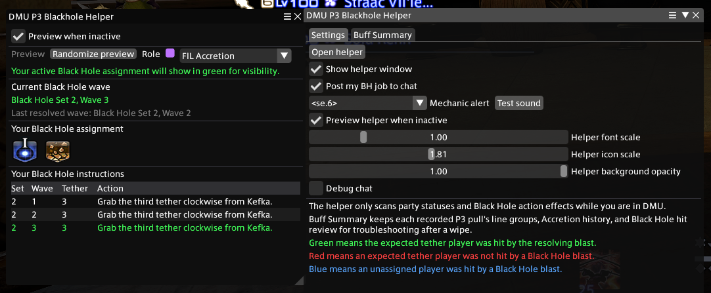
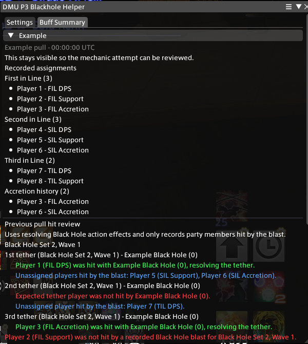

# DMU P3 Blackhole Helper

DMU P3 Blackhole Helper is a Dalamud plugin that watches party debuffs during P3 of Dancing Mad Ultimate.

It currently tracks:

- First in Line
- Second in Line
- Third in Line
- Accretion
- Earth Resistance Down II

## Screenshots

### Helper Window



### Buff Summary

The summary keeps recorded pull assignments, Black Hole hit review, and a death timeline for wipe review.



## Configuration

Open the configuration window in game:

```text
/dmup3
```

Open the helper window directly:

```text
/dmup3h
/dmup3helper
```

The helper is only active in DMU.

## Dalamud Repository

Add this custom plugin repository URL in Dalamud:

```text
https://raw.githubusercontent.com/Nainaiowo/IMakeSillyThings/refs/heads/main/repo.json
```

Then install `DMU P3 Blackhole Helper` from Dalamud's plugin installer.
